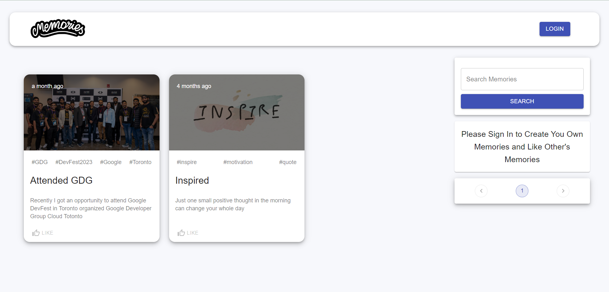
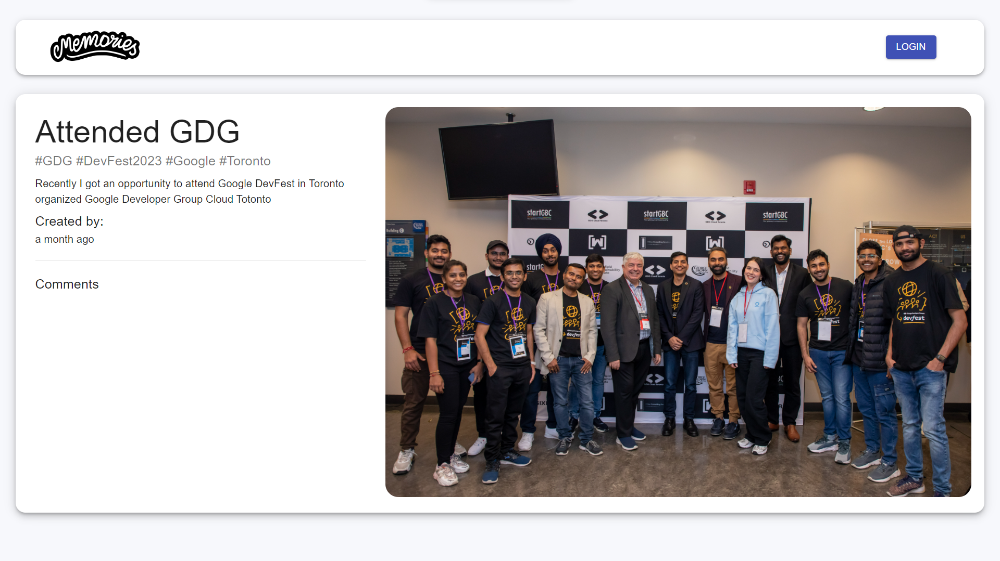
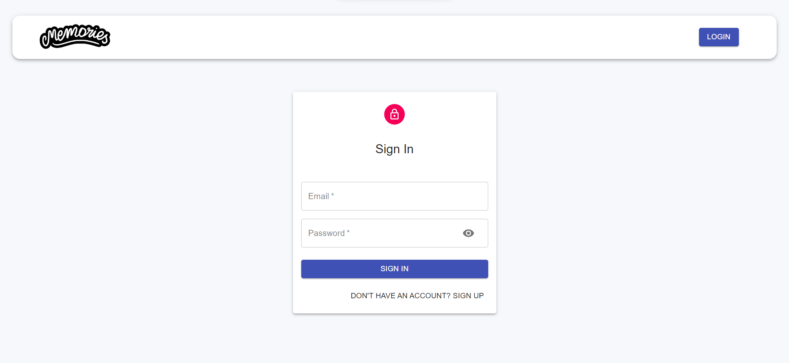
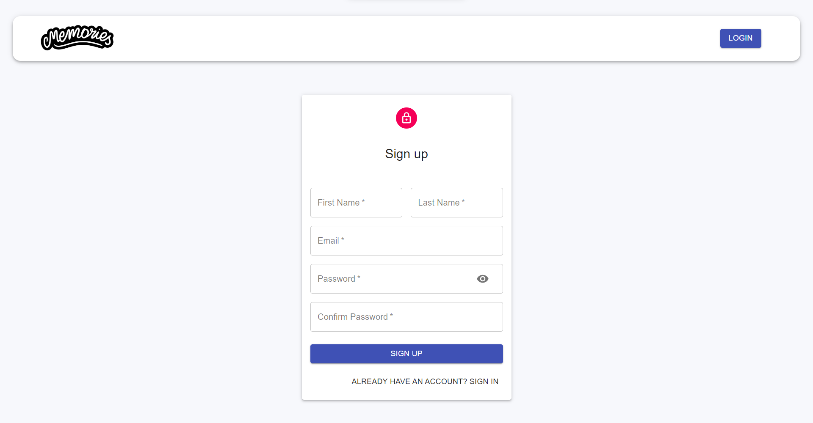
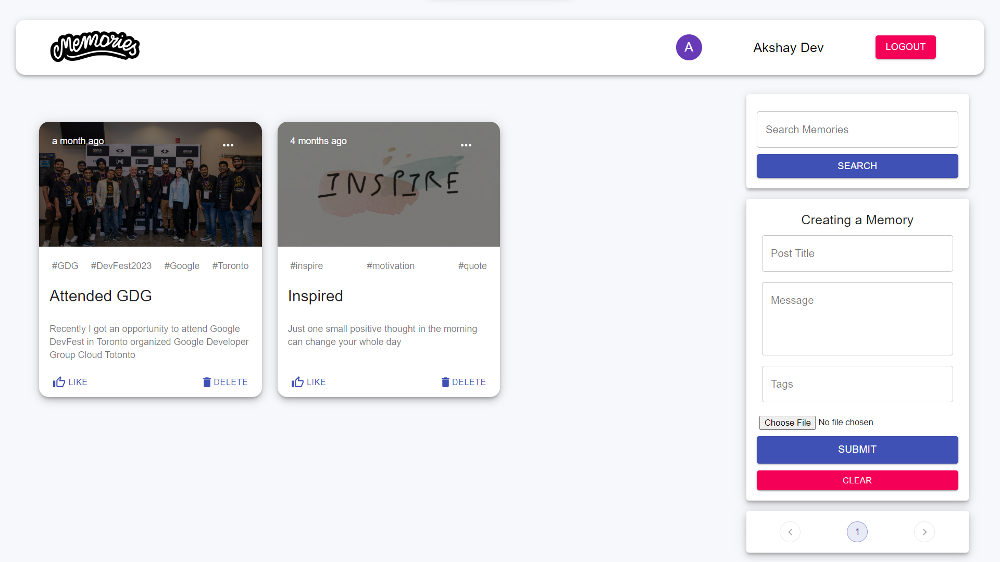
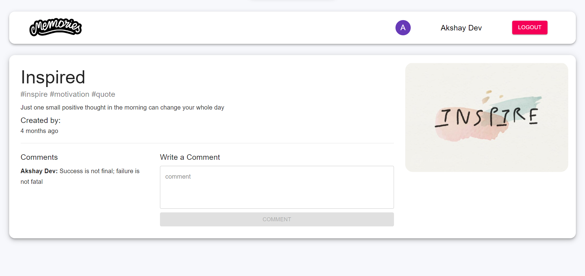

## Memories

#### How to run project

1. Clone the repository:

   ```shell
   git clone https://github.com/akshay-bharadva/memories
   ```

2. Add mongodb-connection-url under `back/.env` directory for `MONGODB_CONNECTION_URL` variable.

3. Install node-modules and start
   - 2.1. for frontend, your frontend will start on port 3000
     ```shell
     cd front
     npm i
     npm start
     ```
   - 2.2. for backend, your backend will start on port 5001
     ```shell
     cd back
     npm i
     npm start
     ```

## Snapshots







